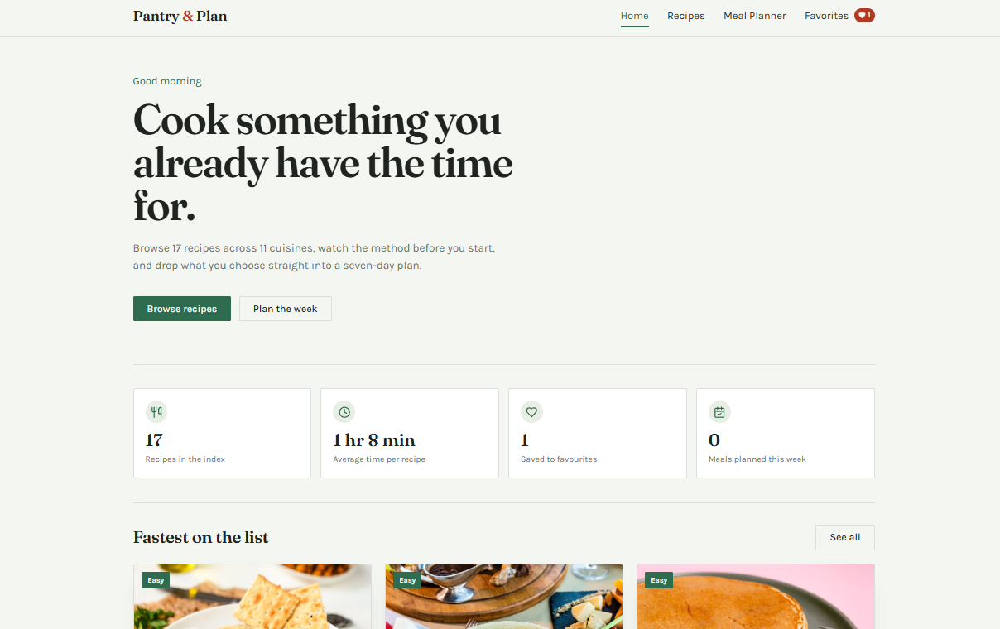
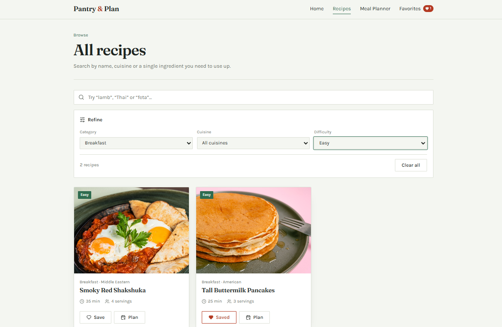
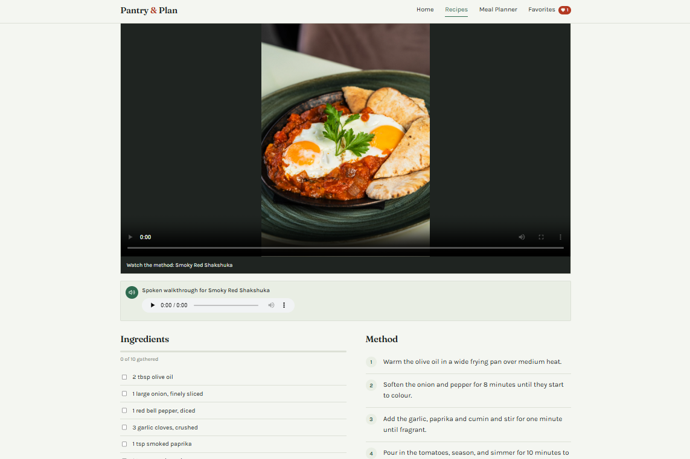
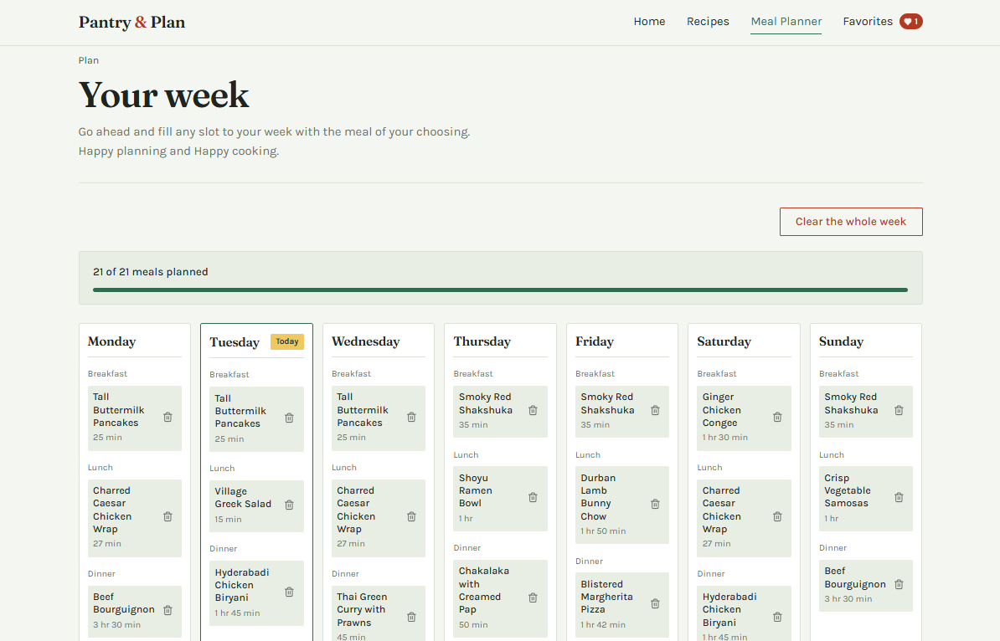
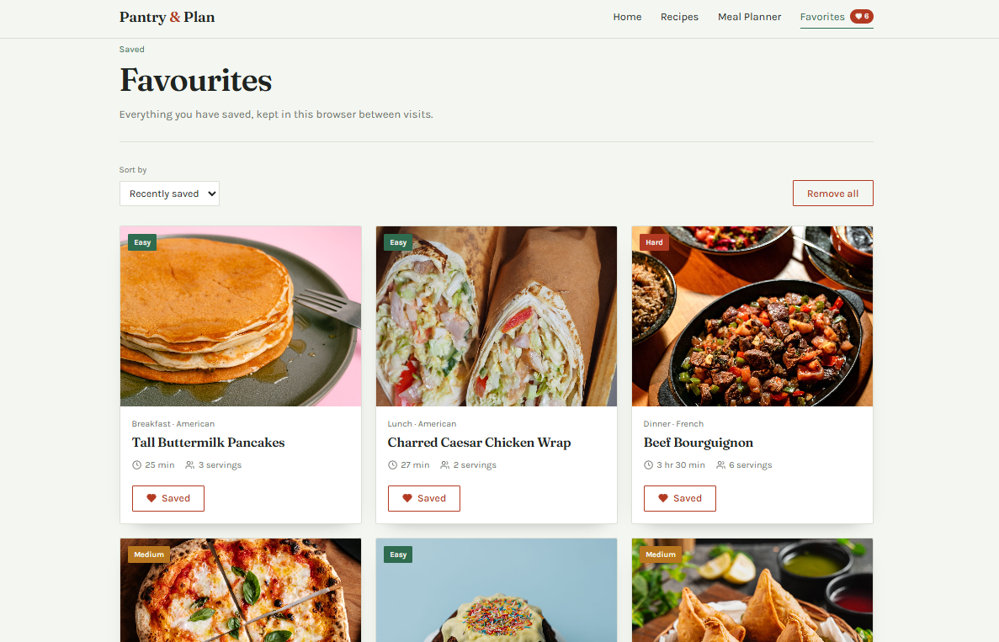
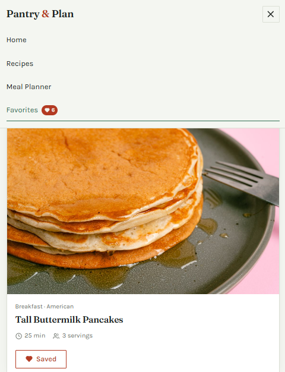

# Project Overview

**Pantry & Plan** is a single-page recipe discovery and meal-planning
application built with React 18 and Vite. It lets you search a 17-recipe index
by name, cuisine or ingredient, filter by category, cuisine and difficulty, open
a full recipe with a technique video and an audio walkthrough, save favourites,
and build a seven-day meal plan. Favourites and the weekly plan persist in
`localStorage`, so closing the tab does not lose your week.



> _Home dashboard showing the greeting, statistics row and quick picks_

## Key Features Implemented

- Live search across titles, cuisines and ingredient lines
- Three-way filtering (category, cuisine, difficulty) with a clear-all control
- Recipe detail view with HTML5 video, audio narration and a tickable
  ingredient checklist that tracks progress
- Seven-day meal planner with three slots per day, add and remove per slot
- Quick-add: drop a recipe into the first free slot straight from a card
- Favourites with sorting, bulk clear and a live count badge in the navigation
- Explicit loading, empty and error states on every asynchronous boundary
- Responsive layout across mobile, tablet and desktop; reduced-motion support



> _Recipes page with filters applied and results narrowed_

## Tech Stack & Tools Used

| Tool | Role |
| --- | --- |
| React 18 | Functional components and hooks only, zero class components |
| React Router 6 | Client-side routing, including a dynamic `/recipes/:id` route |
| Vite 5 | Dev server and production bundler |
| CSS Modules | Scoped component styling |
| PropTypes | Runtime prop validation on core components |
| lucide-react | Icon set |
| PostCSS + Autoprefixer | Vendor prefixing at build time |




> _Recipe detail view with the video player visible_

## Component Architecture & File Structure

```
src/
├── components/
│   ├── UI/            Button, Card, SearchBar, Loading, Modal
│   ├── common/        Header, Footer, common.module.css
│   ├── Navigation/    Navbar
│   ├── Recipe/        RecipeCard, RecipeList, RecipeDetail, RecipeFilter
│   ├── MealPlanner/   MealPlanner, DayCard
│   └── Media/         VideoPlayer, AudioPlayer
├── pages/             Home, RecipesPage, MealPlannerPage,
│                      FavoritesPage, NotFound
├── data/              recipesData.js (mock database)
├── utils/             helpers.js (pure transformations)
├── App.jsx            Router, global state, storage sync
└── main.jsx           Entry point
```

Nesting reaches five levels: `App → RecipesPage → RecipeList → RecipeCard →
Card → Button`.



> _Meal planner showing the seven-day grid with meals assigned_

## State Management & Data Flow Explained

`App.jsx` is the only owner of shared state. It holds `recipes`, `favorites`,
`mealPlan`, plus `isLoading`, `loadError` and `isHydrated`. Those values flow
down as props; children communicate back by calling callbacks they were passed
(`onToggleFavorite`, `onAssignMeal`, `onClearMeal`, `onQuickAdd`).

State that only one screen needs stays in that screen: search text and filter
object in `RecipesPage`, the active slot and picker query in `MealPlannerPage`,
the ingredient checklist in `RecipeDetail`, the focus flag in `SearchBar` and
the menu toggle in `Navbar`.

Three `useEffect` contexts run the lifecycle: loading the recipe index on mount,
reading `localStorage` once on first mount, and writing each state change back
to storage. Meal-plan updates spread the previous object into a new one rather
than mutating it, because React compares state by reference.



> _Favourites page with several saved recipes_

## Installation & Setup Guide

```bash
npm install
npm run dev      # http://localhost:5173
npm run build    # production bundle in /dist
npm run preview  # serve the built bundle
```

Requires Node 18 or newer.



> _Mobile view showing the open hamburger navigation_

## Future Enhancements

- The mock database can be replaced with a real API and server-side search
- A consolidated shopping list can be generated from the week's plan
- Drag-and-drop reordering feature can be added between planner slots
- Implementation of user accounts so that saved favourites can sync across devices
- Implementation of a portion scaling feature that recalculates ingredient quantities in the recipe details
